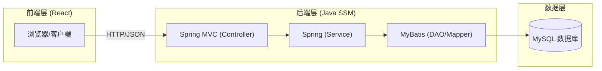
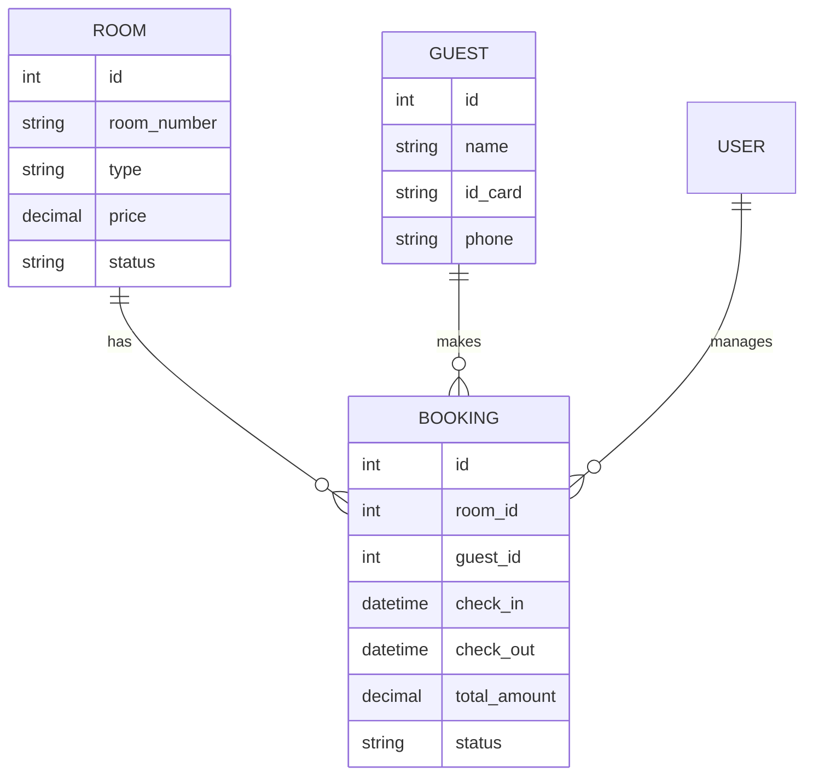

## 1. 架构设计
系统采用典型的前后端分离架构，前端使用 React 进行组件化开发，后端使用 Java SSM 框架提供 RESTful API 服务。



## 2. 技术栈描述
- **前端**: React 18 + TypeScript + Tailwind CSS + Vite
- **后端**: Java + Spring 5 + Spring MVC + MyBatis 3
- **数据库**: MySQL 8.0
- **构建工具**: Maven (后端), npm/pnpm (前端)

## 3. 路由定义
| 路由 | 用途 |
|-------|---------|
| `/login` | 登录页面 |
| `/dashboard` | 首页仪表盘 |
| `/rooms` | 房间管理列表 |
| `/bookings` | 订单/预订管理 |
| `/guests` | 住客信息管理 |

## 4. API 定义
### 4.1 认证接口
- `POST /api/auth/login`: 用户登录
- `POST /api/auth/logout`: 退出登录

### 4.2 房间接口
- `GET /api/rooms`: 获取房间列表（支持分页、状态筛选）
- `PUT /api/rooms/{id}`: 更新房间信息/状态

### 4.3 预订接口
- `POST /api/bookings`: 创建新预订
- `GET /api/bookings`: 查询订单列表

## 5. 数据模型
### 5.1 实体关系图


## 6. 数据定义 (DDL 预览)
```sql
-- 房间表
CREATE TABLE `rooms` (
    `id` INT PRIMARY KEY AUTO_INCREMENT,
    `room_number` VARCHAR(20) UNIQUE NOT NULL,
    `type` VARCHAR(50) NOT NULL,
    `price` DECIMAL(10, 2) NOT NULL,
    `status` ENUM('AVAILABLE', 'OCCUPIED', 'MAINTENANCE') DEFAULT 'AVAILABLE'
);

-- 住客表
CREATE TABLE `guests` (
    `id` INT PRIMARY KEY AUTO_INCREMENT,
    `name` VARCHAR(100) NOT NULL,
    `id_card` VARCHAR(20) UNIQUE NOT NULL,
    `phone` VARCHAR(20)
);

-- 订单表
CREATE TABLE `bookings` (
    `id` INT PRIMARY KEY AUTO_INCREMENT,
    `room_id` INT,
    `guest_id` INT,
    `check_in` DATETIME,
    `check_out` DATETIME,
    `status` VARCHAR(20),
    FOREIGN KEY (`room_id`) REFERENCES `rooms`(`id`),
    FOREIGN KEY (`guest_id`) REFERENCES `guests`(`id`)
);
```
